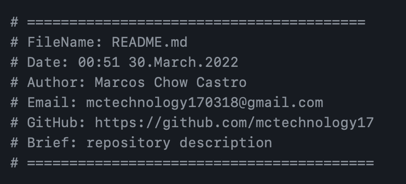

    
    <h1 align="center">Hola, mi nombre es Rodrigo Rodriguez - backend developer </h1>
    <h4 align="center">Analista programador con conocimientos sólidos en programación con lenguajes como Java, Python y
        PL/SQL, motores de bases de datos como Oracle y SQL Server, y metodologías de desarrollo como Scrum y
        tradicional. Poseo habilidades analíticas y de resolución de problemas, y una pasión por la tecnología y la
        informática. Busco una oportunidad para aplicar mis conocimientos en una empresa dinámica y en crecimiento.
        También cuento con habilidades de comunicación y trabajo en equipo, y siempre estoy dispuesto a aprender y
        mejorar.
    </h4>

<table align="right">
<tr>
<td>

[][GitHub]
[][Linkedin]
[][Gmail]
[][WhatsApp]

</td>
</tr>
</table>

  
:zap: Sobre Mi!

### 🔬 Analista Programador Computacional egresado de Duoc UC 💻!!
- 🦾 ¡Me encanta la informatica!
- 🤓 Actualmente estoy enfocado en fortalecer mi conocimiento para desarrollo del lado del backend.
- 👾 Soy muy curioso y por eso estoy en constante busqueda de nuevos conocimientos sobre programación.
- 🗒 Actualmente estoy muy obsesionado con aprender Spring framework y Angular

 

---

<h3 align="center"> ltimos proyectos</h3>

<tr>
<td>

</td>
<td> <h4 align="left"> <a href="https://github.com/Rod-rodriguezF-28/sistema-contactos" target="_blank"><code>Sistema Contactos</code></a> </h4> </td>
</tr>
<tr>
<td>

<tr>
<td>

</td>
<td> <h4 align="left"> <a href="https://github.com/Rod-RodriguezF-28/TvShow.git" target="_blank"><code>Sistema Valoracion de tvShow</code></a> </h4> </td>
</tr>
<tr>
<td>

</td>
<!--  -->
<td> <h4 align="right"> <a href="https://github.com/Rod-RodriguezF-28/portafolio.git" target="_blank"><code>portafolio ficticio (HTML5 - CSS3)</code></a</h4> </td>
</tr>
<tr>
<td>
 
 

---

<h3 align="center"> Languajes y Herramientas</h3>

    
    
    
    
    
    
    
    
    
    
    
    

---

<h3 align="left"> Estadísticas de GitHub</h3>

  <a href="https://github.com/Rod-rodriguezF-28">
  
  

---

[GitHub]:https://github.com/Rod-rodriguezF-28
[Linkedin]:https://www.linkedin.com/in/Rod-rodriguezF-28/
[Gmail]:https://mail.google.com/mail/u/0/?tab=rm&ogbl#inbox
[WhatsApp]:https://wa.link/9r8lan

